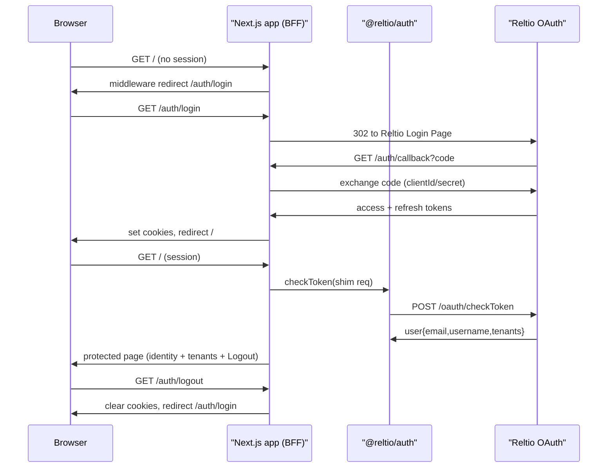

# Reltio App Starter (`@reltio/create-app`)

## Goal (v1 — auth-focused)

`npm create @reltio/app my-app` (or `npx @reltio/create-app my-app`) scaffolds a runnable Next.js App Router app whose **v1 focus is the login/logout auth flow** via `@reltio/auth`: real Reltio OAuth login/logout/callback, route gating, and a plain protected page that proves the session (shows `email`/`username`, the user's real `tenants`, and a Logout button). `@reltio/design`'s `variables.css` is linked for base styling — **no theme providers, no dark/light toggle**. Richer UI (shell, AppSelector, BFF proxy, example data pages, theming) comes later as separate features.

## Deliverables

- New workspace `packages/create-app/` — a published CLI package (`@reltio/create-app`) whose `bin` copies a bundled `template/` into the target dir, templatizes a few files, and optionally runs install + `git init`.
- The bundled auth-focused starter app under `packages/create-app/template/`.
- **Local preview:** root `npm run template` runs the starter in-place (`next dev` inside `template/`, full HMR) so you edit template files and see changes live in the browser (see §3).

## 1. Scaffolder package — `packages/create-app/`

- `package.json`: `"name": "@reltio/create-app"`, `"bin": { "create-app": "./index.mjs" }`, `"publishConfig": { "access": "public" }`, `"license": "Apache-2.0"`, `"files": ["index.mjs", "scaffold.mjs", "template", "README.md", "LICENSE", "NOTICE"]`, `"type": "module"`, `engines node`. No heavy deps — use Node built-ins (`node:fs`, `node:path`, `node:readline`, `node:child_process`). Follows the `bin`-tool pattern of `[packages/design/bin/cli.mjs](packages/design/bin/cli.mjs)` (not the subpath-`exports` library pattern).
- `scaffold.mjs` (shared) — exports `scaffold({ templateDir, targetDir, appName })`: recursively copies `template/` → target while **skipping dev artifacts** (`node_modules`, `.next`, `.env.local`), renames dotfile placeholders (`_gitignore` → `.gitignore`, `_env.local.example` → `.env.local.example`), and rewrites `package.json` `name`. The committed `template/package.json` already lists the **published pinned** `@reltio/design`/`@reltio/auth` versions (consumer-grade), so no dependency rewrite is needed. Used by the CLI; the in-place preview (§4) does not copy at all.
- `index.mjs` CLI behavior:
  1. Read app name from `argv[2]`; if absent, prompt via `readline`.
  2. Validate name (npm-safe), refuse non-empty existing dir.
  3. Call `scaffold(...)`.
  4. Prompt to run install (detect npm/pnpm/yarn from `npm_config_user_agent`) and `git init`.
  5. Print next steps: copy `.env.local.example` → `.env.local`, fill OAuth vars, `npm run dev`.
- Monorepo hygiene: `packages/create-app/template/` is **not** a workspace (root `workspaces: ["packages/*"]` does not match nested dirs), so root `npm install` never touches it and there is no React/Next version clash with the design-system tree. Exclude `packages/create-app/template/**` from root `biome.json` and root `tsconfig.json` so its `next`-importing files aren't linted/type-checked as workspace source. Add a `packages/create-app/.npmignore` (or scope `files`) so the published tarball excludes `template/node_modules`, `template/.next`, `template/.env.local`.

## 2. Bundled starter (`packages/create-app/template/`) — v1 auth-focused

Next.js App Router + TypeScript. Key files:

- `app/layout.tsx` — root layout. In `<head>`, `<link rel="stylesheet">` to `https://reltio.design/variables.css` and `.../fonts.css`; set `data-theme="sap-reltio-light"` statically on `<html>` (per `[guides/ui-architecture.story.mdx](guides/ui-architecture.story.mdx)`). No providers, no theme toggle.
- `lib/auth.ts` — `createNextAuth({ oauthPath, loginPath, clientId, clientSecret, secure })` built from `process.env`; re-exports `handlers` + `checkToken`.
- `app/auth/[...auth]/route.ts` — `export const { GET, POST } = handlers;` (mounts login/logout/callback/refreshToken/checkToken).
- `lib/session.ts` — server helper `getUser()`: builds a minimal `AnyRequest` shim from `next/headers` cookies and calls `checkToken`, returning `CheckTokenResponse` (or `null`); `requireUser()` redirects to `/auth/login` when unauthenticated.
- `middleware.ts` — gate protected routes, redirecting unauthenticated users to `/auth/login?returnTo=...`.
- `app/login/page.tsx` (public) — simple landing with a "Sign in" link/button pointing to `/auth/login`.
- `app/page.tsx` — protected dashboard (server component): calls `requireUser()`, then shows `user.email` / `user.username`, lists real `user.tenants`, and renders a Logout control (link/`Button` to `/auth/logout`). Uses a couple of `@reltio/design/components` (e.g. `Button`, `List`) styled purely via `variables.css` — no provider needed.
- Config: `package.json` (`"private": true`, published-pinned `@reltio/design`/`@reltio/auth` + `next`/`react`/`react-dom`, standard `dev`/`build`/`start` scripts); `next.config.mjs` with `transpilePackages: ["@reltio/design", "@ui5/webcomponents-react", "@ui5/webcomponents", "@ui5/webcomponents-fiori", "@ui5/webcomponents-icons"]`; `tsconfig.json`; `_gitignore`; `_env.local.example` (`OAUTH_PATH`, `LOGIN_PATH`, `CLIENT_ID`, `CLIENT_SECRET`, `SECURE=false` for local http); `README.md`. Dev artifacts created by in-place preview (`node_modules`, `.next`, `.env.local`) are gitignored + npmignored, so the app is genuinely runnable in place yet ships clean.

> UI5 web components render without `ThemeProvider`; for v1 the static `data-theme` + `variables.css` is enough. A `ThemeProvider` re-export in `@reltio/design` and dark/light switching are deferred to a later visual feature.

## Data flow (v1)

## 3. Local preview — `npm run template` (in-place `next dev`)

No copy, no scratch dir. `template/` **is** the runnable app; the preview runs `next dev` directly inside it, so editing any file under `template/` hot-reloads in the browser exactly like a normal Next.js project. It shows the exact same stub the consumer gets (same files, same code).

- Root `package.json` script: `"template": "node scripts/template-preview.mjs"` (accepts `--published`).
- `scripts/template-preview.mjs` (cwd → `packages/create-app/template/`):
  1. Build `@reltio/auth` and `@reltio/design` `dist/` if stale (their `exports` maps resolve to `dist`). Fast mtime check to skip when fresh.
  2. Ensure `template/node_modules` exists — run `npm install` inside `template/` only when missing or `package.json` changed (installs `next`, `react`, the published `@reltio/design`/`@reltio/auth`, transitive `@ui5/*`). Isolated tree — does not touch the monorepo root install.
  3. **Default (local mode):** replace `template/node_modules/@reltio/design` and `.../@reltio/auth` with symlinks to `packages/design` / `packages/auth` (the `npm link` mechanism), so your in-repo source is what renders (useful when iterating on auth). **`--published` mode:** skip the symlink step to run against the installed published packages (consumer fidelity).
  4. Ensure `template/.env.local` exists (create from `_env.local.example` if missing) so a dev can fill OAuth vars once; it persists across runs and is gitignored.
  5. Spawn `next dev` in `template/`.
- `.gitignore`: add `packages/create-app/template/node_modules`, `packages/create-app/template/.next`, `packages/create-app/template/.env.local`.
- Editing `@reltio/design`/`@reltio/auth` source reflects after their `dist` rebuild (`npm run build -w @reltio/design`); editing anything under `template/` is instant via Next HMR.

## 4. Publishing & wiring

- `packages/create-app` is picked up automatically by the release pipeline (per `AGENTS.md` "adding a new publishable package"); copy root `LICENSE`/`NOTICE` into the package (CLI is plain `.mjs`, no build step).
- Add a `changeset` for the new `@reltio/create-app` package.
- Document the starter in a short Storybook guide entry (`guides/`) — optional, doc-only.

## Verification

- **In-repo (live):** `npm run template` boots `next dev` inside `template/`; with `template/.env.local` set to a staging OAuth client: visiting `/` while unauthenticated redirects to login, "Sign in" completes the Reltio OAuth flow, the protected page shows real `email`/`username` + `tenants`, and Logout clears the session. Editing a `template/` file hot-reloads (no re-run).
- **Consumer fidelity:** `npm run template -- --published` runs against installed published packages; scaffold to a temp dir via `node packages/create-app/index.mjs demo-app` and confirm the generated app matches.
- `npm run lint` / `npm run format` pass at repo root (`packages/create-app/template/**` excluded).

## Open considerations

- `checkToken` in Server Components: build a minimal `AnyRequest` shim from `next/headers` `cookies()` (the access token lives in the `access_token` cookie via `@reltio/auth/utils` constants) and pass it to `checkToken`. Confirm the shim shape against `[packages/auth/src/utils/readHeader.ts](packages/auth/src/utils/readHeader.ts)` during implementation.
- Local dev over http: set `SECURE=false` so `@reltio/auth` cookies aren't `Secure`-only and the login redirect uses `http`.
- UI5 web components render fine without `ThemeProvider` for v1; theming/dark-mode is a deferred visual feature.